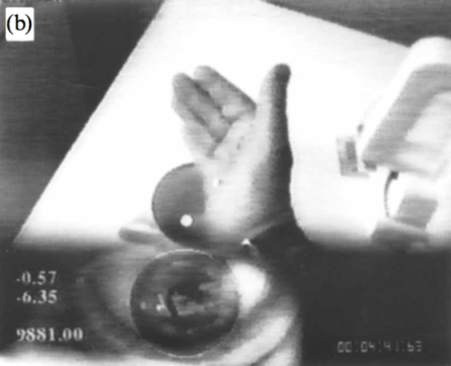
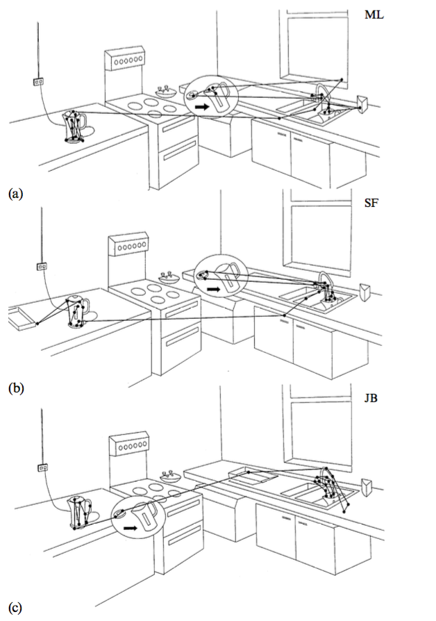
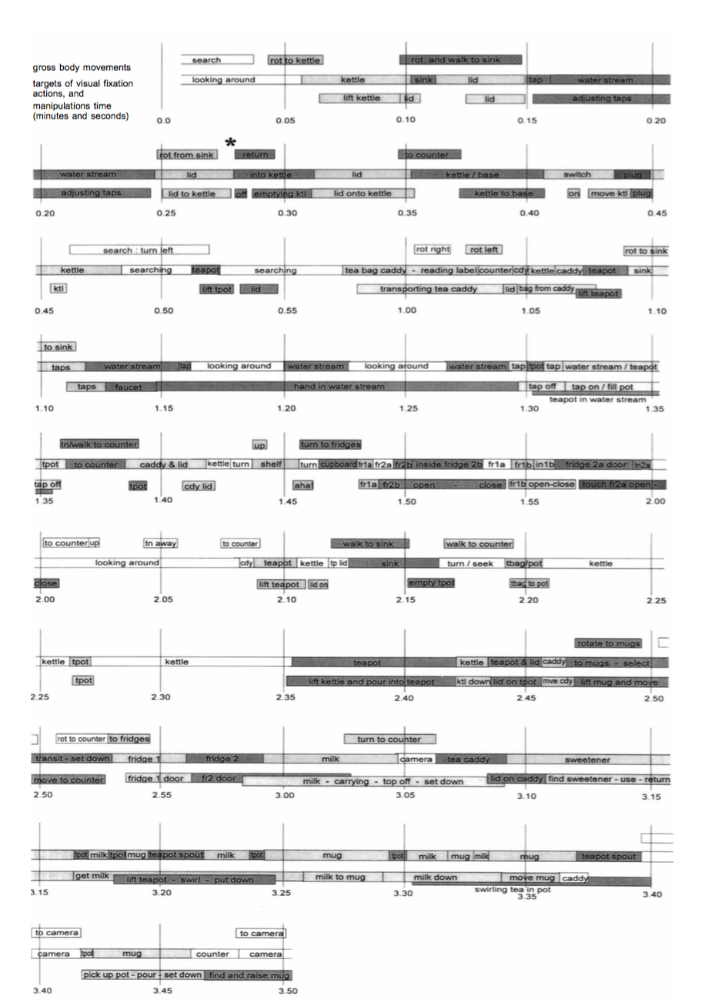
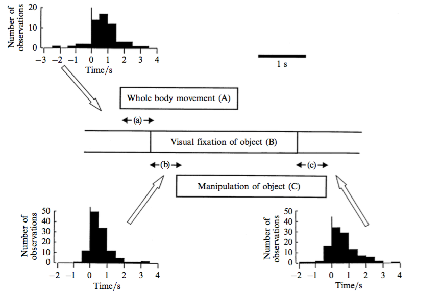
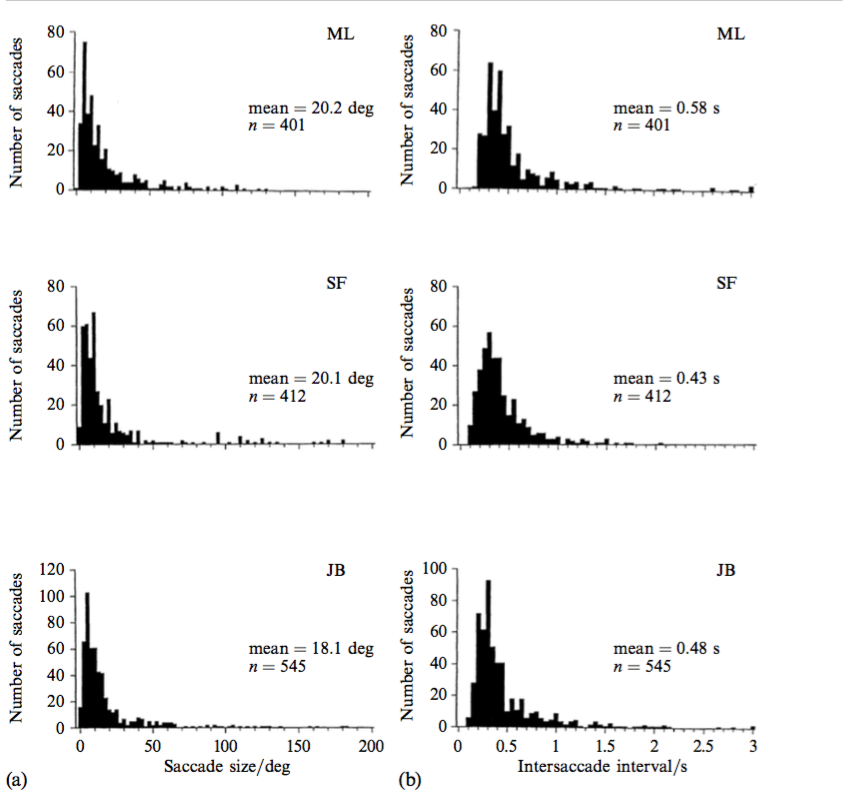
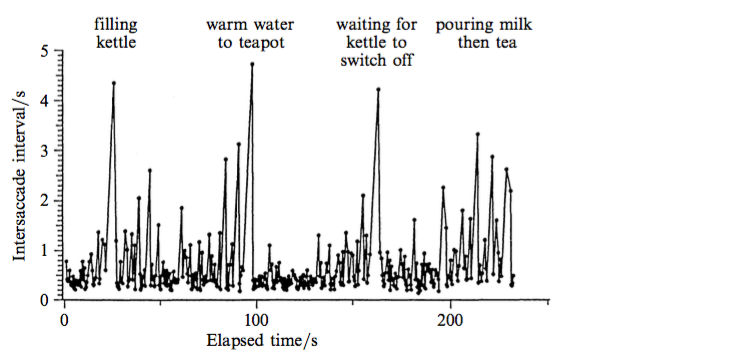
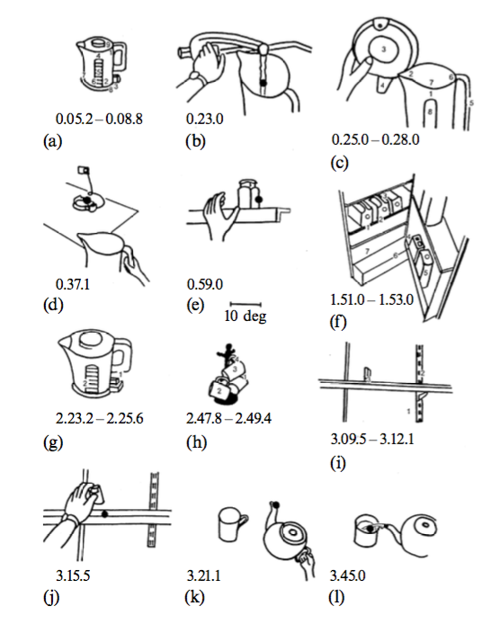

  
- Land, M., Mennie, N., & Rusted, J. (1999). The roles of vision and eye movements in the control of activities of daily living. Perception, 28(11), 1311–1328. Retrieved from http://dx.doi.org/10.1068/p2935 (Ashton & Sandy lead).
    - What did they do? What did they find? Why does it matter? (ideally in R Markdown document).  
    
- Insert relevant images      

