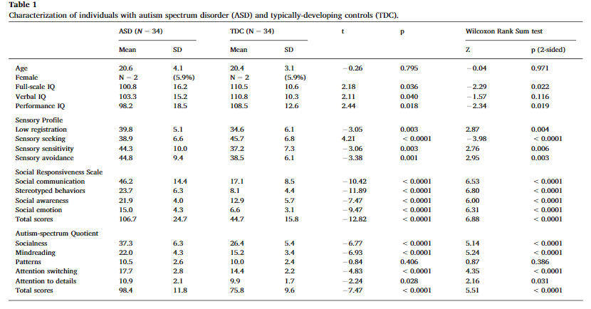
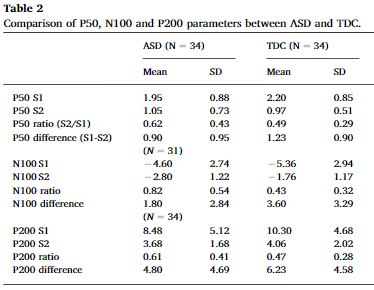
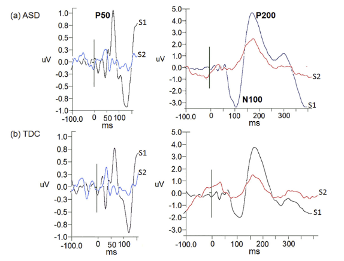

```{r setup, include=FALSE}
knitr::opts_chunk$set(echo = TRUE)
```

# What is sensory gating?  

P50 - suppresses auditory stimuli after 50 ms  
N100 - triggers attention to stimuli  
P200 - allocates attention to auditory stimuli 

# Purpose  

Do adolescents and young adults with ASD have sensory gating deficits? 

Discussion of:

Chien, Y.-L., Hsieh, M. H., & Gau, S. S.-F. (2019). P50-N100-P200 sensory gating deficits in adolescents and young adults with autism spectrum disorders. *Progress in Neuro-psychopharmacology & Biological Psychiatry*, *95*, 109683. Retrieved from http://dx.doi.org/10.1016/j.pnpbp.2019.109683

# Participants  



# Results 



There are no group correlates between P50 and P200 sensory gating.  
  
## N100 Gating Deficits in participants with ASD  

 

# Discussion 

Independent of ASD diagnosis, N100 gating deficits were strongly correlated with sensory sensitivity. N100 sensory gates were the best indicator of an ASD diagnosis.  

P200 gating was correlated with attention switching difficulty in ASD participants, even though there was no difference in the gating itself between the two groups.  

Lack of P50 suppression had negative associations with social deficits in ASD, though the difference between the two groups was not significant enough to differentiate between the TDC and ASD groups. 

# Group Discussion Questions  

#### 1. Why do you think N100 gating had a strong correlation to sensory sensitivity? 

#### 2. What does the correlation between the P200 and attention switching difficulty imply?  

#### 3. Do you think the study is reproducible?  

#### 4. What other neurological disorders might have sensory gating deficits?  
